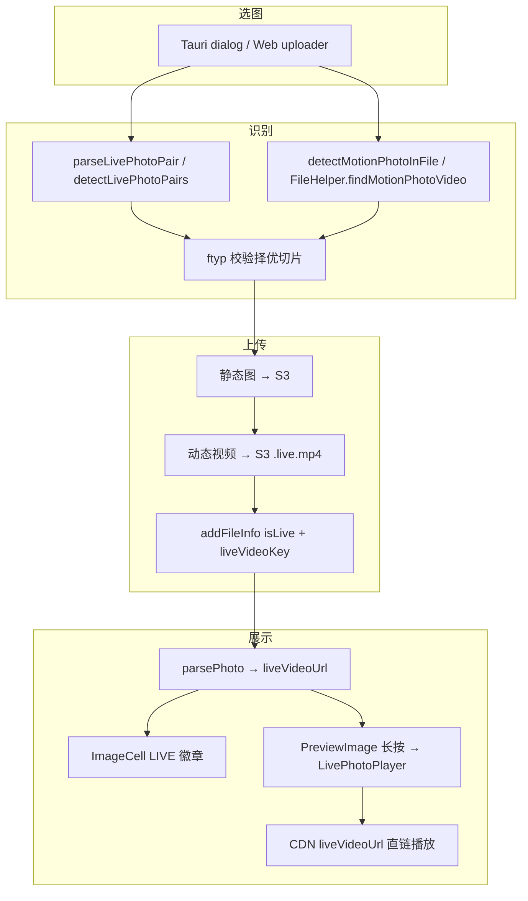

# Live Photo 支持方案 Plan（回溯版）

> 本文档记录 Live Photo 功能的**原始需求、实际落地架构、调试中暴露的问题与修复**，便于后续回溯与扩展。
>
> **状态**：MVP 已落地（2026-06-20），覆盖 Apple 配对、Google/小米 Motion Photo、上传/预览/下载；部分二期能力仍待实现。

---

## 一、背景与需求

### 1.1 用户痛点

echo-trails 相册原先仅支持静态图与普通视频，无法处理 Live Photo / 动态照片：

- 选图时只上传 JPEG/HEIC，丢失动态部分；
- 图片与视频被拆成两条记录；
- 预览无法「长按播放、松手回静帧」。

### 1.2 目标

1. **识别**：客户端识别 Live Photo（Apple 配对 + Android Motion Photo）。
2. **上传与存储**：一条主记录 + 关联 `liveVideoKey`，视频单独存 S3。
3. **预览**：长按播放动态视频，松手停止；列表/预览显示 LIVE 徽章。
4. **下载/导出**：Web zip / Tauri 双文件保存到 Pictures。
5. **双模式兼容**：远程（MongoDB + S3）与本地（Rust SQLite）字段语义一致。

---

## 二、实际落地架构（As-Built）

### 2.1 数据模型

**Server** `packages/server/src/db/photo.ts`：

| 字段 | 类型 | 说明 |
|------|------|------|
| `isLive` | Boolean | 是否为 Live Photo 主记录 |
| `liveVideoKey` | String | 动态视频 S3 key（`${imageKey}.live.mp4` 或 `.mov`） |
| `liveContentId` | String | Apple ContentIdentifier 或 `motion-photo:<name>` |
| `liveDuration` | Number | 动态时长（ms），探测失败时为 0 |

**服务端兜底** `photoService.parsePhoto`：`isLive=true` 但无 `liveVideoKey` 时强制 `isLive=false`，避免脏数据展示 LIVE 徽章。

**本地 DB** `packages/native/src-tauri/src/db/photo.rs`：`normalize_photo` / `merge_photo_row` 读写前规范化，`isLive` 必须有 `live_video_key`。

**前端类型** `packages/app/src/types/index.d.ts`：`Photo` 增加 `isLive/liveVideoUrl/liveVideoKey`；`FileInfoItem` 增加 `liveVideo` 上传期临时字段。

### 2.2 核心工具

`packages/app/src/lib/livePhoto.ts`：

- `isCompleteLivePhoto(photo)`：统一判定「可展示/可预览的 Live Photo」（`isLive && (liveVideoKey || liveVideoUrl)`）。
- `livePhotoDebug(step, data)`：全链路调试日志，过滤关键字 `LivePhoto:DEBUG`。

### 2.3 识别策略（已实现）

#### Apple Live Photo（JPEG/HEIC + MOV/MP4 配对）

| 端 | 实现 |
|----|------|
| **Tauri/Android** | `FileHelper.findLivePhotoVideo`：同目录或 MediaStore 找同名 `.mov/.mp4`；`extractQuickTimeContentId` 读 ContentIdentifier |
| **Web** | `detectLivePhotoPairs(files)`：同名 + 时间戳 ±3s 启发式配对 |
| **Rust** | `parse_live_photo` → JNI 调 `FileHelper`；桌面端同目录扫描 |

#### Google / 小米 / 华为 Motion Photo（单文件 JPEG 尾部嵌 MP4）

| 端 | 实现 |
|----|------|
| **Android** | `FileHelper.findMotionPhotoVideo`：XMP 解析 + ftyp 扫描 + 切片写入 `cache/motion_photo_cache/` |
| **Web** | `detectMotionPhotoInFile(file)`：同等 XMP 逻辑 + ftyp 校验 |

**XMP 字段语义（重要，调试踩坑点）**：

| 格式 | 字段 | 含义 |
|------|------|------|
| **小米 MVIMG / 旧版 MicroVideo** | `GCamera:MicroVideoOffset` | **从文件末尾算起的视频字节数**；起点 = `fileLen - offset` |
| **Google Motion Photo v1+** | `GCamera:MicroVideoOffset` | 从文件头到视频起点的字节偏移 |
| **Container 格式** | `Container:Item Length`（Mime=video/mp4） | 尾部嵌入 MP4 的字节长度；起点 = `fileLen - length` |

实现上对 `MicroVideoOffset` **同时生成两种候选**，用 `ftyp` box 校验择优；`ftyp` 扫描从 **512KB** 起（非 `fileLen/3`，否则漏掉较早嵌入的视频）。

切片写入使用 **`RandomAccessFile.seek`**（`InputStream.skip` 对大偏移不可靠，曾导致识别回归）。

### 2.4 上传流程

`PhotoList.vue` → `uloadOneFile`：

1. 静态图上传 S3；
2. 若 `fileInfo.isLive && fileInfo.liveVideo`：串行上传动态视频，key 为 `${imageKey}.live.mp4|mov`；
3. **仅视频上传成功**才写 `uploadInfo.isLive / liveVideoKey`（失败则降级为普通照片并提示）；
4. Tauri 端 `videoSize <= 0` 跳过视频上传，不落 `isLive`。

**检测入口**：

- Tauri 选图后：`parseLivePhotoPair(filePath)`（支持 `content://` URI）；
- Web 多选：`detectLivePhotoPairs` + 对未配对 JPEG 调 `detectMotionPhotoInFile`；
- `van-uploader` accept 含 `image/*,.mov,.heic,.heif`。

### 2.5 预览交互（实际方案）

原计划「覆盖层 + 静帧 img」；**实际采用**：

```
PreviewImage.vue（van-image-preview cover slot）
  ├── 长按/松手逻辑在此组件（touchstart/mousedown → 200ms 后 play；touchend → stop）
  ├── liveVideoPlayUrl = computed(activeImage.liveVideoUrl)  // 直接用 CDN，不走本地缓存
  └── LivePhotoPlayer.vue（瘦组件：video + LIVE 徽章，pointer-events: none）
```

**刻意不做**：Live Photo 动态视频的 `video_cache` 本地缓存（`useCachedVideo.ts` 仍存在但未接入预览；曾导致 `asset.localhost` 路径不完整、`longPress` 时 `videoUrl` 为空）。

### 2.6 列表与下载

- `ImageCell.vue`：`isCompleteLivePhoto` → 右上角 LIVE 徽章。
- `downloadLivePhoto`：Web jszip 打包 JPG+MOV/MP4；Tauri `save_to_pictures` 双文件。

### 2.7 Native Android 要点

`FileHelper.kt`：

- `content://` URI：`copyContentUriToCache` → `live_photo_import/`，再 Motion Photo 解析；
- Motion Photo 切片缓存：`motion_photo_cache/`，LRU 清理（50 文件 / 200MB）；
- `buildLivePhotoJson` 返回 `videoPath / contentId / duration / videoSize`；
- ProGuard：`-keep` 整个 `FileHelper` 类。

`media.rs`：`LivePhotoInfo { video_path, content_id, duration, video_size }`。

---

## 三、关键文件清单（已实现）

### Server

- `packages/server/src/db/photo.ts` — Schema 字段
- `packages/server/src/service/photoService.ts` — `parsePhoto` 生成 `liveVideoUrl`、脏数据兜底
- `packages/server/src/routers/file.ts` — add/update 接收 live 字段

### Native

- `packages/native/src-tauri/src/command/media.rs` — `parse_live_photo`
- `packages/native/src-tauri/src/db/photo.rs` — 本地 DB 规范化
- `packages/native/src-tauri/gen/android/app/src/main/java/com/echo_trails/app/FileHelper.kt` — 识别 + Motion Photo 切分
- `packages/native/src-tauri/gen/android/app/proguard-rules.pro`

### Web 前端

- `packages/app/src/lib/livePhoto.ts` — 工具函数
- `packages/app/src/lib/file.ts` — 配对、Motion Photo、下载
- `packages/app/src/components/PhotoList/PhotoList.vue` — 检测 + 上传
- `packages/app/src/components/ImageCell/ImageCell.vue` — LIVE 徽章
- `packages/app/src/components/PreviewImage/PreviewImage.vue` — 长按 + 播放 URL
- `packages/app/src/components/LivePhotoPlayer/LivePhotoPlayer.vue` — video 层
- `packages/app/src/service/local/index.ts` — 本地模式 `mapPhoto` 对齐

### 未采用 / 搁置

- `mp4box.js`（Web MOV ContentIdentifier 精确解析）— 未引入，仍用启发式配对
- `useCachedVideo.ts` 接入预览 — 已明确放弃
- 网格 cell 长按预览 — 未做
- iOS PHAsset / PhotoKit — 未做
- 历史照片批量配对脚本 — 未做

---

## 四、调试记录与已知坑（2026-06 实测）

### 4.1 小米 MVIMG_20260619_205810.jpg 完整排障链

| 阶段 | 现象 | 根因 | 修复 |
|------|------|------|------|
| 识别 | `hit:false` | 更严格 ftyp 校验触发重切 + `InputStream.skip` 无法跳到 8MB 偏移 | 改用 `RandomAccessFile`；放宽 content URI 缓存 |
| 识别 | `reject slice offset=8328294` | 误把 `MicroVideoOffset` 当「从头偏移」；该值实为「从尾长度」 | 双语义候选 + ftyp 择优 |
| 切片 | `output missing ftyp` | 同上，切出垃圾数据 | 正确起点 `3493891`，长度 `8328294`（示例文件） |
| 上传 | `videoSize:0` | 前端写死 size，native 未回填 | `videoSize` 字段贯通 Rust/Kotlin/前端 |
| 预览 | `videoUrl:""` 长按无画面 | 异步 `video_cache` 未完成 / 路径残缺 | **预览直接用 `liveVideoUrl` CDN** |
| 预览 | `player.error code:4` | 播放了无效切片或空 src | 切片修复 + 去掉本地视频缓存 |

### 4.2 调试日志约定

```
# Android logcat
adb logcat -s EchoTrails RustStdoutStderr

# 前端 vConsole
过滤: LivePhoto:DEBUG
```

关键步骤关键字：`detect.tauri.result`、`upload.liveVideo.*`、`preview.active`、`preview.longPress.play`、`preview.player.ready/error`。

### 4.3 清缓存命令（排障用）

```bash
adb shell run-as com.echo_trails.app rm -rf \
  cache/motion_photo_cache \
  cache/live_photo_import \
  cache/live_video_cache
```

---

## 五、验收标准（当前状态）

| # | 标准 | 状态 |
|---|------|------|
| 1 | 列表一条记录 + LIVE 徽章 | ✅ |
| 2 | 预览长按播放、松手停止、可滑动换图 | ✅（CDN 直链） |
| 3 | Web：JPEG+MOV 配对；Motion Photo 单文件 | ✅ |
| 4 | 视频上传失败不落库 `isLive` | ✅ |
| 5 | Tauri 离线预览动态部分 | ⚠️ 需网络加载 CDN 视频；静帧仍走图片缓存 |
| 6 | 下载 Live Photo（zip / 双文件） | ✅ |
| 7 | 小米 MVIMG content:// 选图识别上传 | ✅（2026-06-20 验证） |
| 8 | 单元测试覆盖 | ❌ 未做 |

---

## 六、二期 / 待办

1. **iOS 原生**：PHAsset 配对、PhotoKit 写入导出。
2. **Web 精确配对**：按需引入 `mp4box` 读 MOV ContentIdentifier。
3. **网格长按预览**：PhotoList cell 短按播放（性能与手势冲突需设计）。
4. **离线动态预览**：若强需求，可缓存到 `video_cache` 但须修复路径与等待逻辑；当前策略为不缓存。
5. **S3 删除联动**：删主图时同步删 `.live.mp4`。
6. **`liveContentId` 去重**：同 ContentIdentifier 合并提示。
7. **HEVC 兼容**：部分机型 WebView `<video>` 不支持 H.265，需转码或原生播放器。
8. **历史数据迁移脚本**：扫描并按 ContentIdentifier 合并。

---

## 七、架构示意



---

## 八、与原 Plan 的主要差异

| 原 Plan 假设 | 实际情况 |
|-------------|----------|
| MVP 先做 Apple 配对，Motion Photo 二期 | **同期实现** Motion Photo（小米 MVIMG 为首要验证场景） |
| 预览叠加 img + video 切换 | **van-image-preview 静帧 + cover 层 video** |
| Tauri 离线缓存动态视频 | **不做 video_cache**；CDN 直链，避免路径与竞态问题 |
| `MicroVideoOffset` = 从头偏移 | **小米旧版 = 从尾长度**；需双语义 + ftyp |
| `parse_live_photo(paths: Vec)` 批量 | **单路径** `parse_live_photo(file_path)` |
| 引入 mp4box / mp4parse | **未引入**；Rust 手写 QuickTime key 扫描；Web 启发式 |
| 验收含离线动态缓存 | **调整为需网络**；静帧离线可用 |

---

> 维护说明：后续改动 Live Photo 相关逻辑时，请同步更新本文档「实际落地架构」「调试记录」「验收标准」三节。
