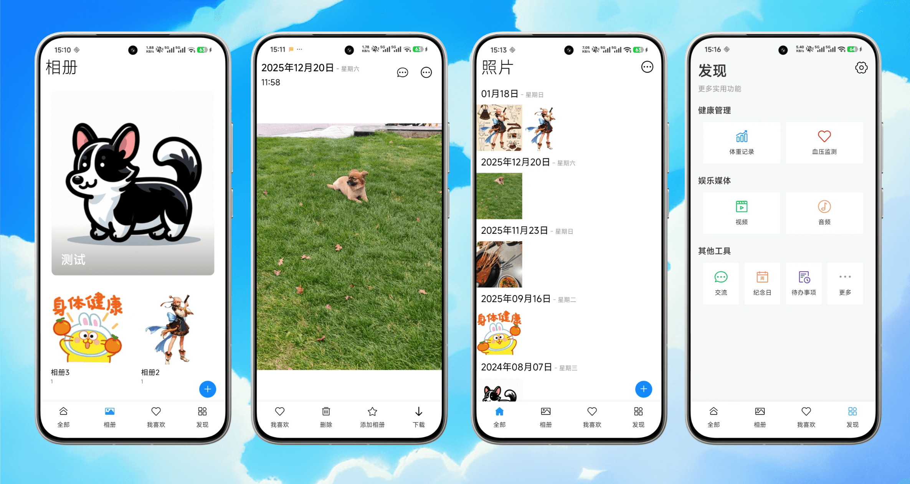

<div align="center">
  <a href="https://github.com/ATQQ/echo-trails">
    
  </a>

  <h3>记忆的回响 | echo-trails</h3>
  <p>
    <a href="https://photo.sugarat.top">Website</a>
    ·
    <a href="https://github.com/ATQQ/echo-trails/releases/latest">Releases</a>
    <br />
    <br />
    <!-- TODO：其它logo -->
  </p>
  <p>一个私人的相册APP</p>
  <i>同时包含一些日常使用的小功能</i>
</div>

_“echo” 可以象征着记忆的回响，过去的经历像回声一样在这些 “trails” 上徘徊，每当走过，就能听到记忆的声音。_



## 🎯 Roadmap

- [x] 平台
  - [x] Web
  - [x] Android
  - [ ] Desktop
  - [ ] iOS
- [x] 数据存储模式
  - [x] Remote Web Server（MongoDB）
  - [ ] 离线 Rust 服务（SQLite）
- [x] 功能
  - [x] 媒体资源上传
    - [x] 相册
    - [x] 视频
    - [ ] 音频
  - [ ] 小功能
    - [x] 体重记录
    - [x] 血压
    - [x] 资产
    - [x] 纪念日
    - [ ] 代办
    - [ ] 。。。

## 🤝 Contributing

### 技术栈

<div align="center">
  <p>
    <strong>90% 代码由AI驱动生成</strong>
  </p>
</div>

- [Web 端](./packages/app/): [Vue 3](https://vuejs.org/) + [Vite](https://vite.dev/) + [Vant](https://vant.pro/vant/) + [Bun](https://bun.sh/)
- [服务端](./packages/server/): [Bun](https://bun.sh/) + [Hono](https://hono.dev/) + [缤纷云](https://www.bitiful.com/)
- [Native](./packages/native/): [Tauri](https://v2.tauri.app/)

### Development

```sh
bun install

# run web
cd packages/app
bun run dev

# run android app
cd packages/native
bun run dev:android

# run server
cd packages/server
bun run dev
```

## 🙏 Acknowledgements

- [SLEA.AI](https://slea.ai/zh-CN): generate the icon
- [Loading Animation](https://css-loaders.com/filling/): The Filling CSS Loaders Collection
- [图标工场](https://icon.wuruihong.com/) - 移动应用图标/启动图生成工具
  - [icon-workshop](https://github.com/zhanghuanchong/icon-workshop): multi-size icons generator
- [MockuPhone](https://mockuphone.com/type/phone/): 带壳截图

## 📝 License

[MIT](./LICENSE)
